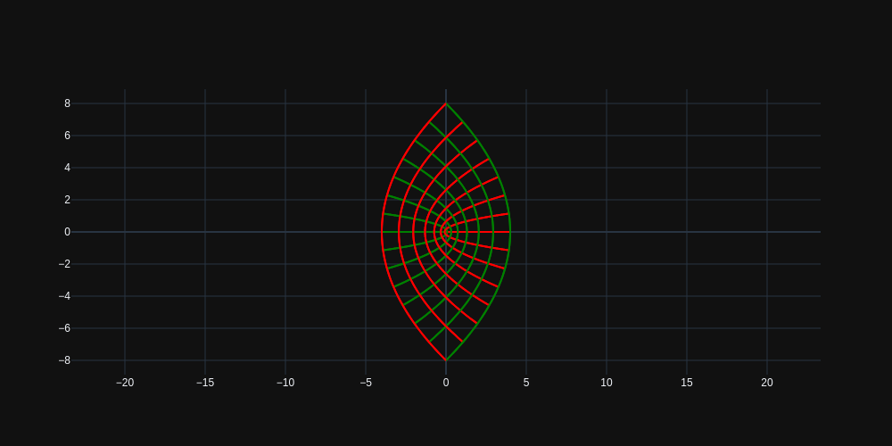
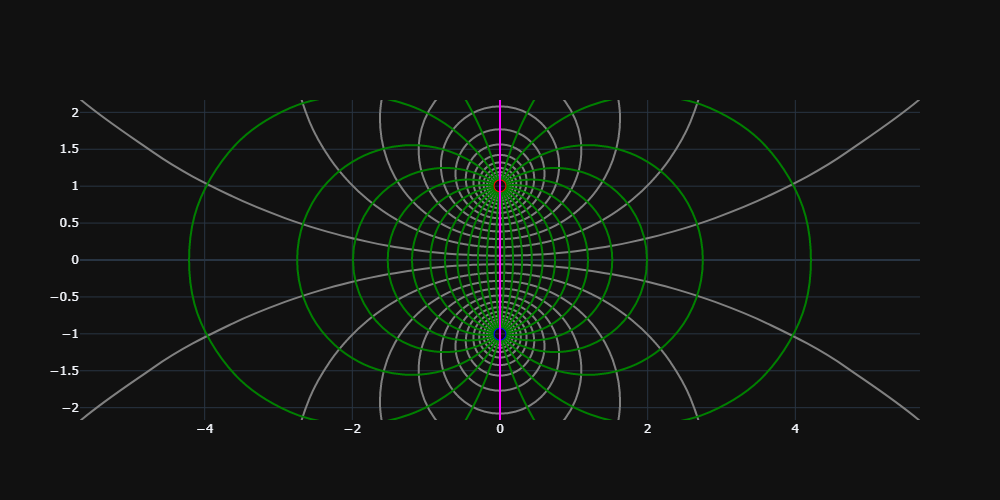
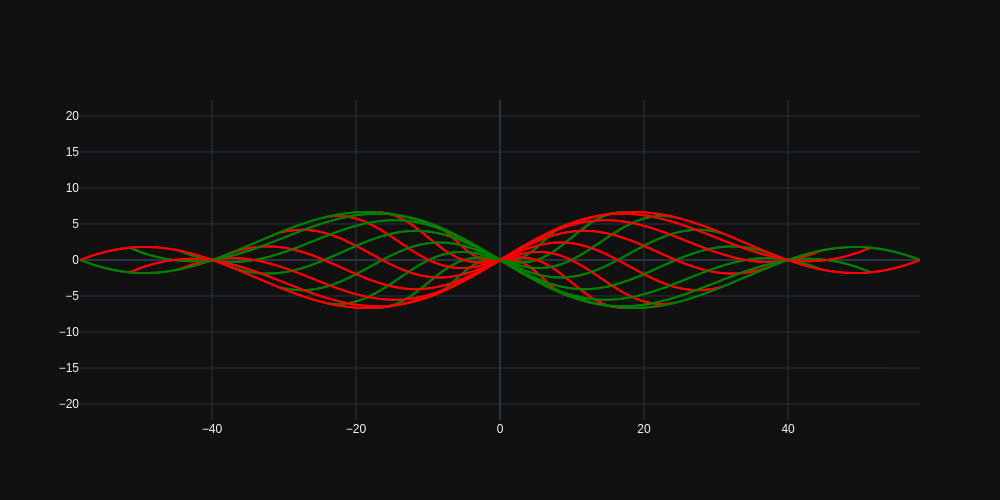
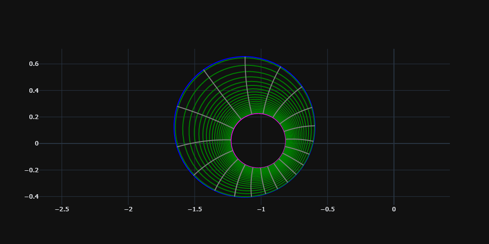
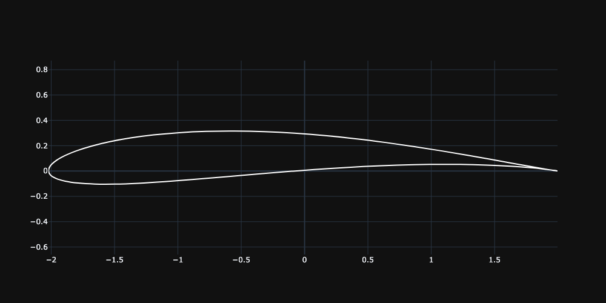

[](https://mybinder.org/v2/gh/im-AMS/Conformal-Maps/HEAD) [](https://conformal-maps.readthedocs.io/en/latest/?badge=latest)

[examples rendered by voila](https://mybinder.org/v2/gh/zolabar/Conformal-Maps/master?urlpath=voila%2Frender%2Fexample_voila.ipynb)

**Note** : It is advisable to download and run the code on your local computer for better performance compared to binder.

# TLDR
> Run the example.ipynb
# conformalMaps

The Python package ```conformalMaps``` is about conformal mappings and their applications. It was made to be as interactive as possible with sliders from IPyWidgets. 

The aim is to create a full package of scientific Python with release, documentation, webpage etc... The package adresses students of applied sciences, lecturers, researchers and engineers and scientists at companies and anyone who wants to visualize how complex variable mappings change plane geometries.

This code offers the possibility to visualize the geometrical change of certain geometries in the complex plane, when functions of a complex variable are applied to them. When angles between lines in the original plane (z-plane) are preserved after the mapping to the new plane (w-plane), one speaks of *conformal mappings* (see [BC09](https://www.mheducation.com/highered/product/complex-variables-applications-brown-churchill/M9780073383170.html)). 

A code documentation can be found on the [project readthedocs page](https://conformal-maps.readthedocs.io/en/latest/index.html).


## Run the code

### Method 1
Use git,

&nbsp;&nbsp; &nbsp;&nbsp; copy the url from above, open the terminal and type
```
git clone URL
```
&nbsp;&nbsp;&nbsp;&nbsp; **Note** it will be cloned to current working directory.

### Method 2
&nbsp;&nbsp;&nbsp;&nbsp; Download normally from the above icon,extract it into any location.

&nbsp;&nbsp;

### How to RUN?

First install the dependencies.

It is preferable to run this notebook with Jupiter lab, with the extensions shown below.

**Note**  *if there is stutter(sudden blank and reapperance) of graph on update, it means the extensions for jupyterlab are not installed correctly.*

system req:
```
            Jupyter lab

            Python3.7

            modules from requirements.txt

```
To install all the dependecies open therminal and type the below.
```bash
            pip install -r requirements.txt

                        or

            conda install --file requirements.txt

            jupyter labextension install @jupyter-widgets/jupyterlab-manager
            
            jupyter nbextension enable --py widgetsnbextension
```
Check if jupyter lab extensions are installed
```
            jupyter labextension list
```
you should something similar
```
JupyterLab v3.1.8

(bla bla)

jupyterlab-plotly v5.2.2 enabled OK
@jupyter-widgets/jupyterlab-manager v3.0.0 enabled OK (python, jupyterlab_widgets)

(bla bla)
```

Alternatively, install the requirements and use ```jupyter notebook```. You can also test the code in [binder](https://mybinder.org/).

### The Fun part!!
Open terminal in the location where you have cloned/downloaded and Type
```
jupyter lab
```

Open the `example.ipynb`

And **RUN!!!**

## Examples

Here are a few preview images, that show how squares get transformed by complex variable mappings. 

**Caution:** One of those may not be conformal, or angle preserving! In case of doubt consult the function ```check_analytic```.

w=e^z (origin is the square [-1.5, 1.5] x [-1.5, 1.5])


w=z^2 (origin is the square [-1.5, 1.5] x [-1.5, 1.5])


w=z^3 (origin is the square [-1.5, 1.5] x [-1.5, 1.5])


w=tan (z/2) (origin is the square [-3.14, 3.14] x [-3.14, 3.14])


w=2xy + i(y sin x - x sin y) (origin is the square [-5, 5] x [-5, 5])


w=(z+1)/(i-z) (origin is an annulus with radii 3 and 7)


w=z+1/z (circle boundary, center at (-0.08, 0.08), radius = 1.08)

## Applications

In [PHW33](https://www.tandfonline.com/doi/abs/10.1080/14786443309462212) and [LG21](https://conference.scipy.org/proceedings/scipy2021/lauer_bare_gaertig.html) the conformal mapping between an eccentric annulus and a rectangle is used to solve a viscous flow problem analytically. The mapping is ilustrated by the following animation. The class ```RectangleToEccentricAnnulus``` from the module ```mappings``` helps to create a rectangle, that methods from ```RectangleToEccentricAnnulus``` map to a desired eccentric annulus. Further, ```ConcentricAnnulusToEccentricAnnulus``` illustrates relations between concentric and eccentric annuli, which are used in [LG21](https://conference.scipy.org/proceedings/scipy2021/lauer_bare_gaertig.html), too. See also the [public github repository](https://github.com/zolabar/ConformalMappingSympy).


## References

[BC09] [Brown J.W., Churchill R.V., Complex variables and applications, Eighth edition, McGraw-Hill Book Company; 2009](https://www.mheducation.com/highered/product/complex-variables-applications-brown-churchill/M9780073383170.html)

[LG21] Lauer-Baré Z. and Gaertig E., [*Conformal Mappings with SymPy: Towards Python-driven Analytical Modeling in Physics*. Lauer-Baré, Z. & Gaertig, E. In Agarwal, M., Calloway, C., Niederhut, D., & Shupe, D., editors, Proceedings of the 20th Python in Science Conference, pages 85 - 93, 2021](https://conference.scipy.org/proceedings/scipy2021/lauer_bare_gaertig.html)

[PHW33] [Piercy N.A.V., Hooper M.S., Winny H.F., LIII. Viscous flow through pipes with cores, The London, Edinburgh, and Dublin Philosophical Magazine and Journal of Science, 1933](https://www.tandfonline.com/doi/abs/10.1080/14786443309462212)

# ToDos

- Error outputs if incomplete/wrong function entered, and also disappears if corrected in Jupyter.
- Standalone pip package with just output graph.
- Improve Documentation.
