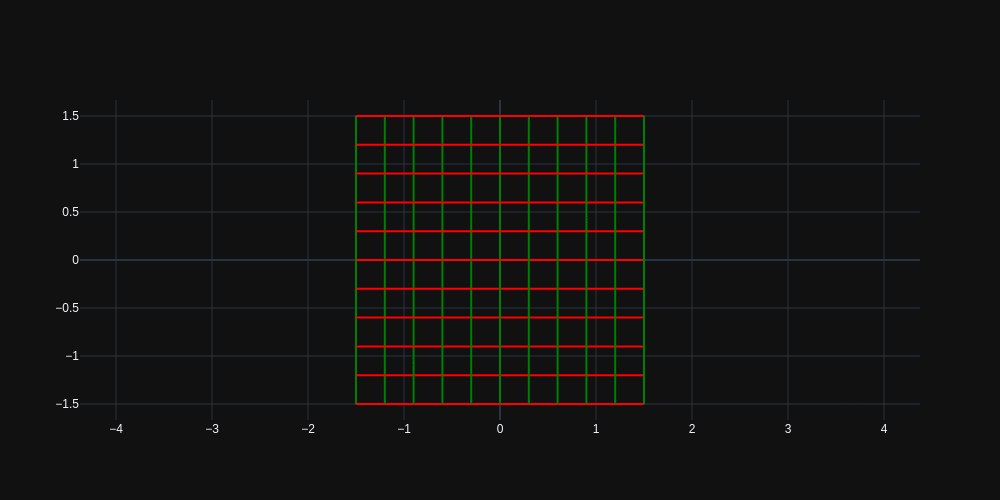
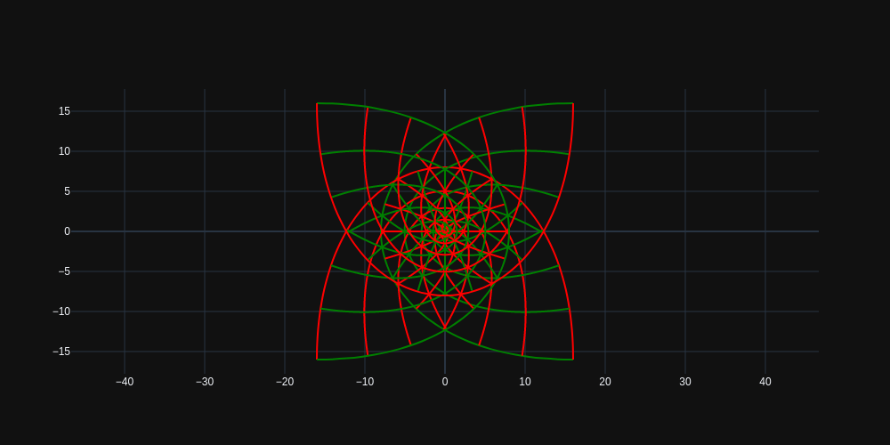
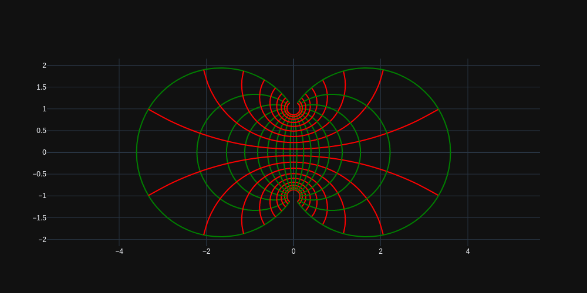
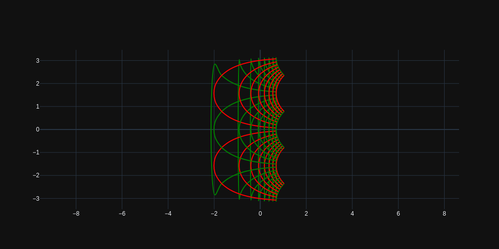

## Conformal-Maps

This code is about conformal mapping.
I have tried to make it as interactive as possible with sliders from IPyWidgets.

To run the code,
## Method 1
Use git,

&nbsp;&nbsp; &nbsp;&nbsp; copy the url from above, open the terminal and type
```
git clone URL
```
&nbsp;&nbsp;&nbsp;&nbsp; **Note** it will be cloned to current working directory.

## Method 2
&nbsp;&nbsp;&nbsp;&nbsp; Download normally from the above icon,extract it into any location.

&nbsp;&nbsp;

## How to RUN?

First install the dependencies.

system req:
```
            Jupyter lab

            Python3.7

            modules from requirements.txt

```
To install all the dependecies open therminal and type the below.
```
            pip install -r requirements.txt

                        or

            conda install --file requirements.txt

            jupyter labextension install @jupyter-widgets/jupyterlab-manager

            jupyter labextension install @jupyterlab/plotly-extension
```
Check if jupyter lab extensions are installed
```
            jupyter labextension list
```
you should get the following
```
jupyterLab v1.2.14
Known labextensions:
   app dir: $anaconda or python path$/jupyter/lab
        @jupyter-widgets/jupyterlab-manager v1.1.0  enabled  OK
        @jupyterlab/plotly-extension v1.0.0  enabled  OK
```

## The Fun part!!
Open terminal in the location where you have cloned/downloaded and Type
```
jupyter lab
```

Open the `final_main_output.ipynb`

And **RUN!!!**

Here are a few preview images.

w=e^z


w=z^2


w=z^3


w=tan z


w=2ab + i(b sin a - a sin b)


w=ln z
