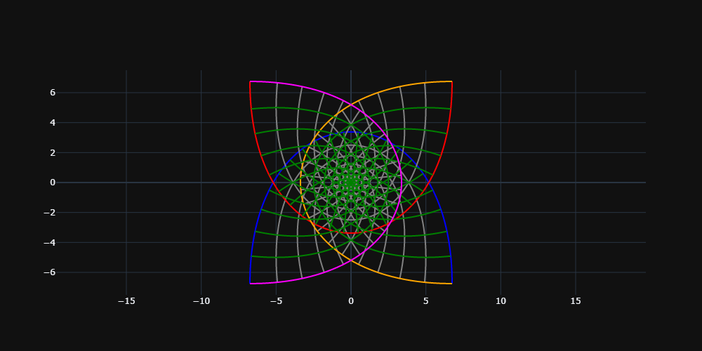
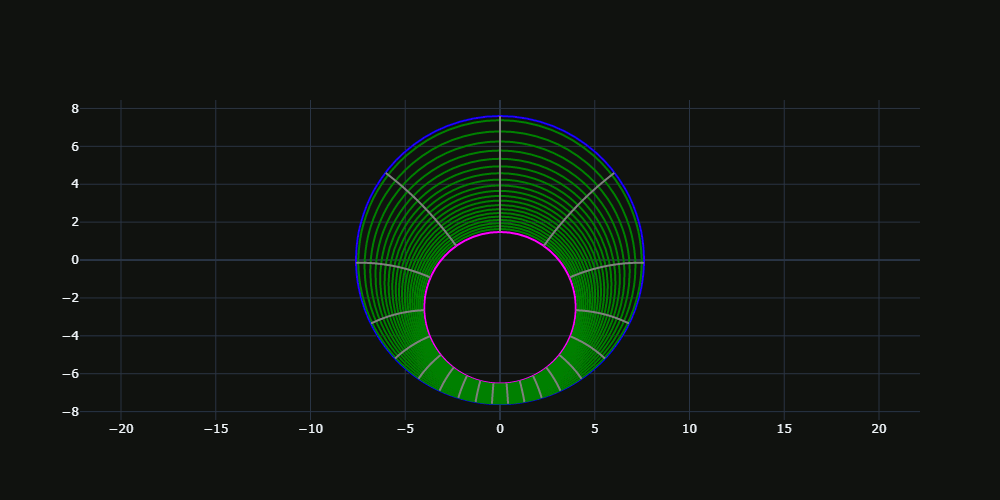
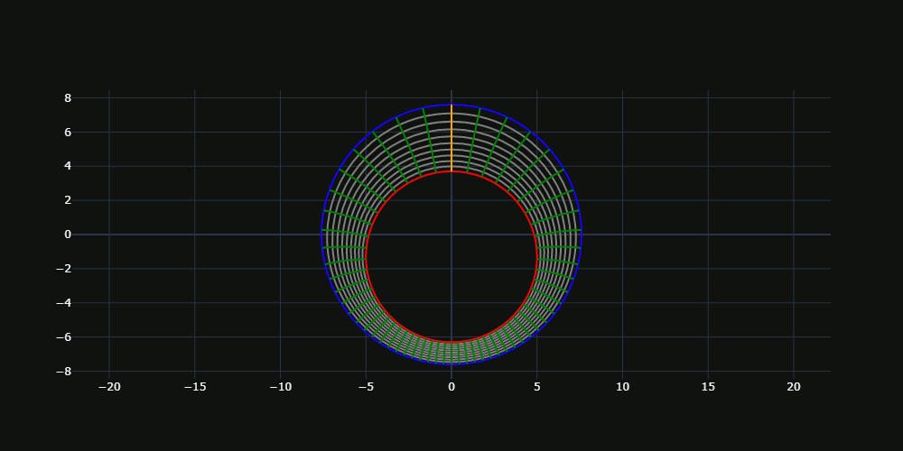
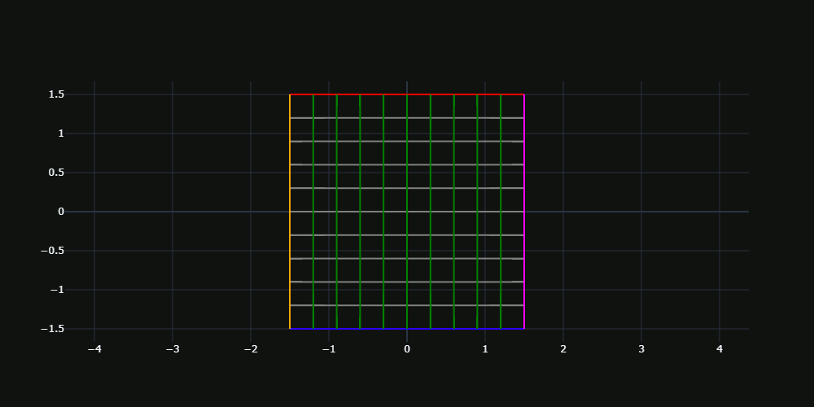

=======
Gallery
=======

Static
------

.. math::

   w(z)=\tan(\frac{z}{2})

.. image:: Figures/tanz_2.png
    :width: 800
    
.. math::

   w(z)=z+\frac{1}{z}
    
.. image:: Figures/Joukowsky-transform.png
    :width: 800
    
.. math::

   w(z)=z^3 
 

Animated
--------

.. math::

   w(z)=(z + i a)/(a z + i)     

.. math::

   w(z)=2\arctan((z+i\gamma)/c)   
    

    
.. math::

   w(z)=e^z   
   

