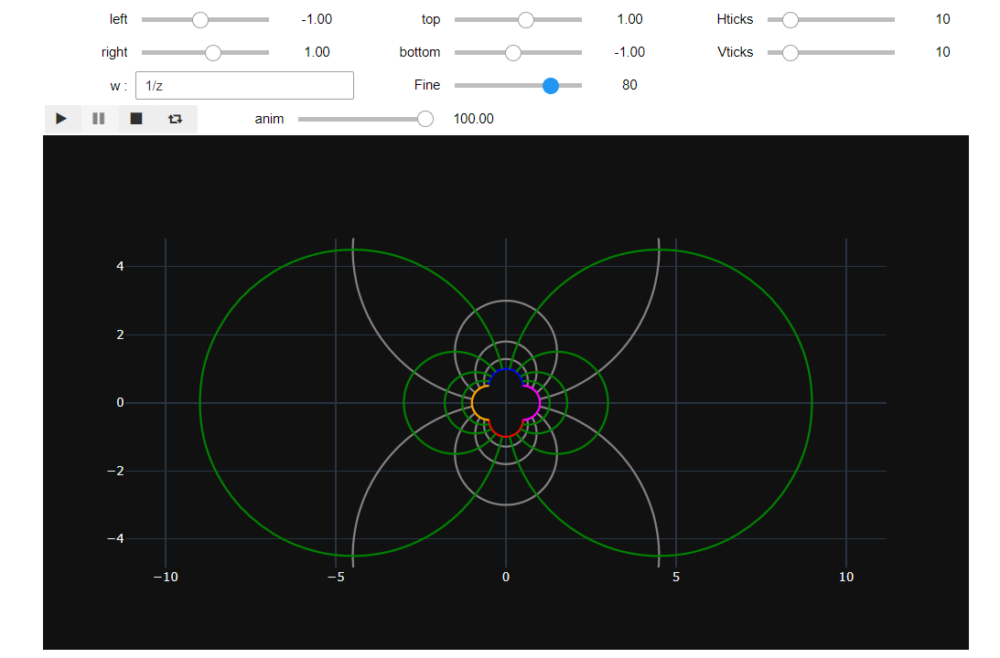

.. Conformal Mappings documentation master file, created by
   sphinx-quickstart on Sun Aug 22 01:29:12 2021.
   You can adapt this file completely to your liking, but it should at least
   contain the root `toctree` directive.

Welcome to conformalMaps documentation!
==============================================

This package conformalMaps is about conformal mappings and their applications. It was made to be as interactive as possible with sliders from IPyWidgets.
The aim is to create a full package of scientific Python with release, documentation, webpage etc... The package adresses students of applied sciences, lecturers, researchers and engineers and scientists at companies.

- Application examples can be found on `Conformal Mappings with SymPy <https://github.com/zolabar/ConformalMappingSympy>`_  
- Back to `Conformal-Maps github repository <https://github.com/im-AMS/Conformal-Maps>`_ 

The following figure illustrates the GUI for the deformation of a rectangular geometry.

.. toctree::

   conformalMaps

Indices and tables
==================

* :ref:`genindex`
* :ref:`modindex`
* :ref:`search`

References
==========

[BC09]Brown J.W., Churchill R.V., `Complex variables and applications, Eighth edition, McGraw-Hill Book Company, 2009 <https://www.mheducation.com/highered/product/complex-variables-applications-brown-churchill/M9780073383170.html>`_

[LG21] Lauer-Baré Z. and Gaertig E., `Conformal Mappings with SymPy: Towards Python-driven Analytical Modeling in Physics*. Lauer-Baré, Z. & Gaertig, E. In Agarwal, M., Calloway, C., Niederhut, D., & Shupe, D., editors, Proceedings of the 20th Python in Science Conference, pages 85 - 93, 2021 <https://conference.scipy.org/proceedings/scipy2021/lauer_bare_gaertig.html>`_

[PHW33] Piercy N.A.V., Hooper M.S., Winny H.F., `LIII. Viscous flow through pipes with cores, The London, Edinburgh, and Dublin Philosophical Magazine and Journal of Science, 1933 <https://www.tandfonline.com/doi/abs/10.1080/14786443309462212>`_
